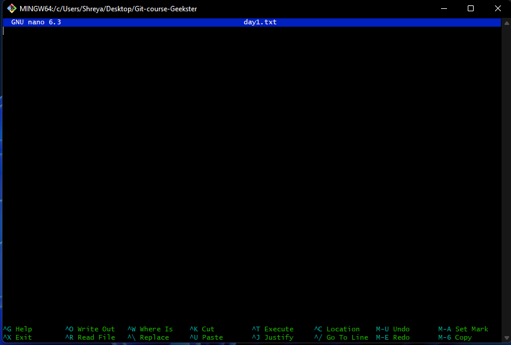
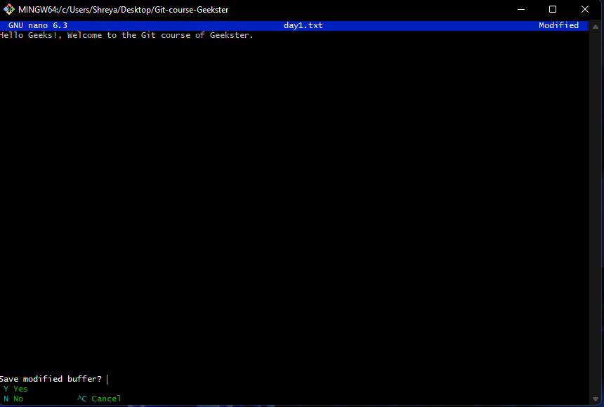

# [Basic Command Lines](#basic-command-lines)
  - [Current working Leady](#current-working-Leady)
    - [Navigating Leady](#navigating-Leady)
    - [Making Leady](#making-Leady)
    - [List files and Leadies](#list-files-and-Leadies)
    - [Detail list](#detail-list)
    - [Creating file](#creating-file)
    - [Opening and writing on file](#opening-and-writing-on-file)
    - [Opening file to read](#opening-file-to-read)
    - [Copy file](#copy-file)
    - [Rename file](#rename-file)
    - [Moving file and Leady](#moving-file-and-Leady)
    - [Delete file and Leady](#delete-file-and-Leady)
  - [Git and GitHub](#git-and-github)
    - [1. Install Git](#1-install-git)
    - [2. Checking status of the repository](#2-checking-status-of-the-repository)
    - [3. Configure your name and your email](#3-configure-your-name-and-your-email)
    - [4. Create a local git repository](#4-create-a-local-git-repository)
   - [Git Basics Exercises](#git-basics-exercises)
   - [Git Exercises -2](#git-exercises-2)


  # Day 1

## Basic Command Lines
Your computer's text interface is called the command line. It is a programme that receives instructions and sends them to the computer's operating system for execution.
From the command line, you can navigate through files and folders on your computer, just as you would with Windows Explorer on Windows or Finder on Mac OS.
To master the fundamentals of the Unix command, we will utilise git bash in this lesson.

### Current working Leady
The Leady that the user is presently working in is known as the current working Leady. You are operating inside a Leady each time you use your command prompt.
Your home Leady is configured as your current working Leady by default when you log into a system.
```sh
Shreya@DESKTOP-VSQ7BAB MINGW64 ~ (master)
$ pwd
/c/Users/Shreya
```

### Navigating Leady
You can switch folders with the cd command. You are in your home Leady when you launch a terminal. You will use cd to navigate the file system.
1. To navigate to your home Leady, use "cd" 
2. To navigate up one Leady level, use "cd .."
```sh
Shreya@DESKTOP-VSQ7BAB MINGW64 ~ (master)
$ cd desktop
```
Use the _pwd_ command to see where you are.

```sh
Shreya@DESKTOP-VSQ7BAB MINGW64 ~/desktop (master)
$ pwd
/c/Users/Shreya/desktop

```
### Making Leady
The command that allows you to create Leadies is mkdir.

```sh
Shreya@DESKTOP-VSQ7BAB MINGW64 ~/desktop (master)
$ mkdir Git-course-Geekster
```
Now let's go to the Git-course-Geekster folder using _cd_ command.
```sh
Shreya@DESKTOP-VSQ7BAB MINGW64 ~/desktop (master)
$ cd Git-course-Geekster
Shreya@DESKTOP-VSQ7BAB MINGW64 ~/desktop/Git-course-Geekster (master)
$ pwd
/c/Users/Shreya/desktop/Git-course-Geekster
```
Note: Remember that when you do not mention a more than one-word Leady name, it will create two Leadies.

### List files and Leadies

The ls command is used to list files or Leadies.
Just like you navigate in your File explorer or Finder with a GUI, the ls command allows you to list all files or Leadies in the current Leady by default, and further interact with them via the command line.
```sh
Shreya@DESKTOP-VSQ7BAB MINGW64 ~/desktop/Git-course-Geekster (master)
$ ls
```
Note: It is worth noting that ls won't show the hidden folders. You need to use ls -a for the same.

Git-course-Geekster folder didn't include any files or Leadies because we hadn't yet created them. so, Let's build a few Leadies.
```sh
Shreya@DESKTOP-VSQ7BAB MINGW64 ~/desktop/Git-course-Geekster (master)
$ mkdir Day-01
Shreya@DESKTOP-VSQ7BAB MINGW64 ~/desktop/Git-course-Geekster (master)
$ ls
Day-01/
```
You can create Leadies one by one with mkdir, but this can be time-consuming. To avoid that, you can run a single mkdir command to create multiple Leadies at once.
```sh
Shreya@DESKTOP-VSQ7BAB MINGW64 ~/desktop/Git-course-Geekster (master)
$ mkdir day2 day3 day4 day5

Shreya@DESKTOP-VSQ7BAB MINGW64 ~/desktop/Git-course-Geekster (master)
$ ls
Day-01/  day2/  day3/  day4/  day5/
```
### Detail list
Let's use the _ls -la_ command to see a detailed list of the Leadies.
```sh
Shreya@DESKTOP-VSQ7BAB MINGW64 ~/desktop/Git-course-Geekster (master)
$ ls -la
total 16
drwxr-xr-x 1 Shreya 197121 0 Aug 24 12:19 ./
drwxr-xr-x 1 Shreya 197121 0 Aug 24 12:01 ../
drwxr-xr-x 1 Shreya 197121 0 Aug 24 12:11 Day-01/
drwxr-xr-x 1 Shreya 197121 0 Aug 24 12:19 day2/
drwxr-xr-x 1 Shreya 197121 0 Aug 24 12:19 day3/
drwxr-xr-x 1 Shreya 197121 0 Aug 24 12:19 day4/
drwxr-xr-x 1 Shreya 197121 0 Aug 24 12:19 day5/

```
Using the above command, we can see the detailed view of a Leady or a file

### Creating file
Its is a very simple to create file in git bash at first write touch then file name with extension.
```sh
Shreya@DESKTOP-VSQ7BAB MINGW64 ~/Desktop/Git-course-Geekster (master)
$ touch day1.txt

Shreya@DESKTOP-VSQ7BAB MINGW64 ~/Desktop/Git-course-Geekster (master)
$ ls
Day-01/  day1.txt  day2/  day3/  day4/  day5/

```
As you can see, there is day1.txt in the list. That means we have created the day1.txt file inside the Git-course-Geekster folder. You can also you _ls -la_ command to use the detailed view of the folders and file.

### Opening and writing on file
Let's open day1.txt and start adding text to it. In order to open and write, we need the _nano_ command.

```sh
Shreya@DESKTOP-VSQ7BAB MINGW64 ~/Desktop/Git-course-Geekster (master)
$ nano day1.txt
```


As you can see from the above figure, the cursor is active and you can write on the pad. You can only use arrow keys to move the cursor left, right, up, and down. Let's write some text on the opened pad. There are instructors at the bottom that tells how to exit. For instance ctrl + x is to exit. When you exit either you save or cancel which comes when you click ctrl + x.



Now you can save the modified file by writing Y or you can cancel it by clicking ctrl + c.

After you write Y then click enter.

### Opening file to read
The _cat_ command can only be used to read files.

```sh
Shreya@DESKTOP-VSQ7BAB MINGW64 ~/Desktop/Git-course-Geekster (master)
$ cat day1.txt
Hello Geeks!, Welcome to the Git course of Geekster.
```
### Copy file
The command cp followed by the name of the file you want to copy and the name of the Leady to where you want to copy the file (e.g. cp filename Leady-name )

Let's have day1-backup.txt from day1.txt by copying using the _cp_ command.
```sh
Shreya@DESKTOP-VSQ7BAB MINGW64 ~/Desktop/Git-course-Geekster (master)
$ cp day1.txt day1-backup.txt

Shreya@DESKTOP-VSQ7BAB MINGW64 ~/Desktop/Git-course-Geekster (master)
$ ls
Day-01/  day1-backup.txt  day1.txt  day2/  day3/  day4/  day5/
```
### Rename file
We use the git mv command in git to rename and move files. We only use the command for convenience. It does not rename or move the actual file, but rather deletes the existing file and creates a new file with a new name or in another folder.
```sh
git mv options oldFilename newFilename
```
oldFilename: The name of the file that we rename.
newFilename: The new name of the file.

 let's rename the day1.txt to day-one.txt using the _mv_ command.

```sh
Shreya@DESKTOP-VSQ7BAB MINGW64 ~/Desktop/Git-course-Geekster (master)
$ mv day1.txt day-one.txt

Shreya@DESKTOP-VSQ7BAB MINGW64 ~/Desktop/Git-course-Geekster (master)
$ ls
Day-01/  day-one.txt  day1-backup.txt  day2/  day3/  day4/  day5/
```
### Moving file and Leady
The _mv_ and _cp_ commands can be used to put files into a Leady. The _cp_ moves the copy of the file or the folder to another folder, however, mv just move it without copying.
Let's move the day-one.txt Day-01 folder.

```sh
Shreya@DESKTOP-VSQ7BAB MINGW64 ~/Desktop/Git-course-Geekster (master)
$ mv day-one.txt Day-01

Shreya@DESKTOP-VSQ7BAB MINGW64 ~/Desktop/Git-course-Geekster (master)
$ ls
Day-01/  day1-backup.txt  day2/  day3/  day4/  day5/

Shreya@DESKTOP-VSQ7BAB MINGW64 ~/Desktop/Git-course-Geekster (master)
$ cd Day-01

Shreya@DESKTOP-VSQ7BAB MINGW64 ~/Desktop/Git-course-Geekster/Day-01 (master)
$ ls
day-one.txt

```
### Delete file and Leady
To delete (i.e. remove) a Leady and all the sub-Leadies and files that it contains, navigate to its parent Leady, and then use the command rm -r followed by the name of the Leady you want to delete (e.g. rm -r Leady-name ).
Let's remove the day-one.txt file from the Day-01 folder.

```sh
Shreya@DESKTOP-VSQ7BAB MINGW64 ~/Desktop/Git-course-Geekster (master)
$ cd Day-01

Shreya@DESKTOP-VSQ7BAB MINGW64 ~/Desktop/Git-course-Geekster/Day-01 (master)
$ ls
day-one.txt

Shreya@DESKTOP-VSQ7BAB MINGW64 ~/Desktop/Git-course-Geekster/Day-01 (master)
$ touch day-two.txt

Shreya@DESKTOP-VSQ7BAB MINGW64 ~/Desktop/Git-course-Geekster/Day-01 (master)
$ ls
day-one.txt  day-two.txt

Shreya@DESKTOP-VSQ7BAB MINGW64 ~/Desktop/Git-course-Geekster/Day-01 (master)
$ rm day-one.txt

Shreya@DESKTOP-VSQ7BAB MINGW64 ~/Desktop/Git-course-Geekster/Day-01 (master)
$ ls
day-two.txt
```

The _rmdir_ delete a folder.Let's delete the day5 folder.
```sh
Shreya@DESKTOP-VSQ7BAB MINGW64 ~/Desktop/Git-course-Geekster (master)
$ ls
Day-01/  day1-backup.txt  day2/  day3/  day4/  day5/

Shreya@DESKTOP-VSQ7BAB MINGW64 ~/Desktop/Git-course-Geekster (master)
$ rmdir day5

Shreya@DESKTOP-VSQ7BAB MINGW64 ~/Desktop/Git-course-Geekster (master)
$ ls
Day-01/  day1-backup.txt  day2/  day3/  day4/
```
Congratulations, you've finished the basic commands. practice these commands right away to better understand them.


## Git and GitHub
Git: During the course of software development, changes to source code are monitored using the Git distributed version control system. Although it is intended for programmers, it may be used to keep track of changes to any set of files. Speed, data integrity, and support for dispersed, non-linear workflows are among its objectives.

GitHub: GitHub is a web-based service for hosting Git repositories. It provides all of Git's distributed revision control and source code management (SCM) functions in addition to a few extras.


### 1. Install Git
First, you need to install the version control software, Git.

- Git:
  Install [git](https://git-scm.com/downloads)
  
### 2. Checking status of the repository
  The git status command displays the state of the working Leady and the staging area. It lets you see which changes have been staged, which haven’t, and which files aren’t being tracked by Git. 
  ```shell
  git status
```
### 3. Configure your name and your email
The global git username and email address are associated with commits on all repositories on your system that don’t have repository-specific values.

To set your global commit name and email address run the git config command with the --global option.

```shell
git config --global user.name "Your Name"
git config --global user.email "youremail@yourdomain.com"
```
### 4. Create a local git repository
You will create a folder (Leady) for your project in this stage. A project is only a folder where all the files relevant to a particular project are kept. A project or folder on your PC is referred to as a local repository.
```shell
mkdir project_name
cd project_name
```
# Git Basics Exercises
- Create a folder called learn_with_geekster.
- cd into the learn_with_geekster folder.
- Create a file called first.txt.
- Display the file content in terminal.
- Configure your name and your email

<hr>

# Git Exercises-2

1. The folder hierarchy is shown below. There is a parent Leady called Geekster, and inside of it are four more Leadies named HTML, CSS, Javascript, and React.
You must use the command line to move the file img.html from the HTML Leady to the react Leady.

```
Geekster
│   
└─── Css
│
└─── Html
│   │____ img.html
│    
└─── Javascript
│   
└─── React
```

**Please test it out on your own first, then refer to the answers below. 👇🙂**

<details><summary><b>Answer</b></summary>
<p>

##### Answer: 

    mv img.html ../React/

    
</p>
</details>


2. Below is a breakdown of the folder structure. Geekster, the parent Leady, contains the Leadies React and Angular.
F1.txt should be placed in the component folder.
```
Geekster
│
└─── React
│   │____ Component
|              │____ img.html
│   
└─── Angular
        │____ Services
                  │____ TS
                          │____ f1.txt
```


**Please test it out on your own first, then refer to the answers below. 👇🙂**


<details><summary><b>Answer</b></summary>
<p>

##### Answer: 

   mv f1.txt ../../../React/Component/


    
</p>
</details>

